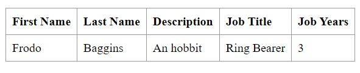
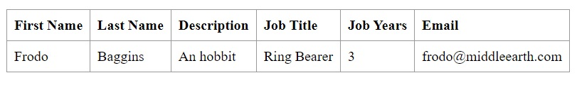

# CA1 - Version Control with GIT
## Table of Contents

1. [CA1 - Technical Report](#technical-report)
   - [Analysis, Design and Implementation - Part 1](#part-1)
   - [Analysis, Design and Implementation - Part 2A](#part-2A)
   - [Analysis, Design and Implementation - Part 2B](#part-2B)
2. [Alternative Solution (SVN) - Analysis Report](#analysis-report)
   - [Introduction](#introduction)
   - [Comparison between Git and Subversion](#comparison-between-git-and-subversion)
   - [Conclusion](#conclusion)

## Technical Report
### Analysis, Design and Implementation

### Part 1
1. **Setup:**
    - To start the `CA1 - Part 1` assignment, the tutorial code was copied directly from the desktop to the designated project
      folder. To ensure a clean slate, the existing `.git` and `.gitignore` folders were removed from the copied directory.
    - An empty `README.md` file was also created to serve as the main documentation for the project. These changes were
      then committed and pushed to the repository.
#### Git commands used:
      - git add filenames
      - git commit -m "message"
      - git push

2. **Tagging:**
    - A tag was created `v1.1.0` following a versioning pattern of `major.minor.revision` for clear and structured version
      management.
#### Git commands used:
      - git tag -a tagname -m "message"
      - git push origin tagname

3. **Adding New Feature:**
    - To implement the new feature the following steps were taken:
        - A new field `jobYears` was added to the `Employee` class.
        - Validation was added to the `Employee` class fields to ensure that they cannot be null or empty and to ensure
          that the new field is a positive integer.
        - Relevant methods and/or code in the `Employee` class were modified to incorporate the new field.
    - The code in the `Database Loader` was adjusted to include the new field when creating or loading
      employee data.
    - The `React Component` responsible for rendering and handling employee data was updated to display and manage the
      new field.
### Git commands used: 
      - git add filenames
      - git commit -m "message"
      - git push

      - optional:
         - create a new issue on github
         - git commit -m "message closes #issuenumber"

4. **Unit Testing:**
    - To ensure the correctness of the implemented feature, unit tests were conducted as follows:
        - Unit tests were implemented testing scenarios where all fields were appropriately `set and get`.
        - Additional unit tests were implemented to `validate fields constraints`.
### Git commands used:
       - git add filenames
       - git commit -m "message"
       - git push
   
       - optional:
         - create a new issue on github
         - git commit -m "message closes #issuenumber"

5. **Tagging and Conclusion:**
    - A tag was created `v1.2.0` following the creation of the new feature.
    - A tag `ca1-part1` was also created to mark the end of part 1 of the assignment.
### Git commands used:
      - git tag -a tagname -m "message"
      - git push origin tagname

### Part 2A

1. **Setup:**
    - To start the `CA1 - Part 2A` of the assignment, a new branch `email-field` was created.
### Git commands used:
      - git branch branchname
      - git switch branchname

3. **Adding New Feature:**
    - To implement the new feature the following steps were taken:
        - A new field `email` was added to the `Employee` class.
        - Validation was added to the `Employee` class new field to ensure that it cannot be null or empty.
        - Relevant methods and/or code in the `Employee` class were modified to incorporate the new field.
    - The code in the `Database Loader` was adjusted to include the new field when creating or loading
      employee data.
    - The `React Component` responsible for rendering and handling employee data was updated to display and manage the
      new field.
### Git commands used:
      - git add filenames
      - git commit -m "message"
      - git push

      - optional:
         - create a new issue on github
         - git commit -m "message closes #issuenumber"

4. **Unit Testing:**
    - To ensure the correctness of the implemented feature, unit tests were conducted as follows:
        - Unit tests were implemented testing scenarios where the new field was appropriately `set and get`.
        - Additional unit tests were implemented to validate the `new field constraints`.
### Git commands used:
      - git add filenames
      - git commit -m "message"
      - git push

      - optional:
         - create a new issue on github
         - git commit -m "message closes #issuenumber"

5. **Tagging and Conclusion:**
    - The `email-field` branch was merged into the `main` branch.
    - A tag was created `v1.3.0` following the creation of the new feature.
### Git commands used:
      - git merge --no-ff branchname
      - git tag -a tagname -m "message"
      - git push origin tagname

### Part 2B

1. **Setup:**
    - To initiate `CA1 - Part 2B` of the assignment, a new branch `fix-invalid-email` was created.
### Git commands used:
      - git branch branchname
      - git switch branchname

3. **Fixing Feature Bug:**
    - To fix the new feature bug the following steps were taken:
        - Validation was added to the `Employee` class to ensure that the `email` field cannot be null or empty and needs to contain the symbol `@`.
        - Relevant methods or code in the `Employee` class were modified to incorporate this change.
### Git commands used:
      - git add filenames
      - git commit -m "message"
      - git push

      - optional:
         - create a new issue on github
         - git commit -m "message closes #issuenumber"

4. **Unit Testing:**
    - To ensure the correctness of the implemented validations, unit tests were conducted as follows:
        - Additional unit tests were implemented to validate the `email` field constraints, such as ensuring no values without the `@` symbol were allowed.
### Git commands used:
      - git add filenames
      - git commit -m "message"
      - git push

      - optional:
         - create a new issue on github
         - git commit -m "message closes #issuenumber"

5. **Tagging and Conclusion:**
    - The `fix-invalid-email` branch was merged into the `main` branch.
    - A tag was created `v1.3.1` following the implementation of the bug fix.
    - A final tag `ca1-part2` was created to mark the end of the assignment.
### Git commands used:
      - git merge --no-ff branchname
      - git tag -a tagname -m "message"
      - git push origin tagname

## Analysis Report
### Analysis of Subversion (SVN) as an alternative to Git

### Introduction
Subversion, often abbreviated as SVN, is a version control system designed to manage and track changes to files and directories over time. It is particularly useful for software development projects but can be applied to any scenario where versioning and collaboration are essential.

1. **Version Control:**
    - Subversion helps teams `manage and control different versions` of their project's source code and related files. It tracks changes made by multiple developers, providing a history of modifications.

2. **Repository:**
    - Subversion uses a `centralized repository` to store the project's files and their versions. This repository serves as a `central hub` where team members can commit changes and retrieve the latest updates.

3. **Checkouts and Working Copies:**
    - Developers typically perform a `checkout` to create a `local working copy of the repository`. This working copy allows them to make changes to the files, which can later be committed back to the `central repository`.

4. **Branching and Merging:**
    - Subversion supports `branching and merging`, allowing developers to work on different features or bug fixes in isolation and later merge those changes back into the main codebase.

5. **Atomic Commits:**
    - Commits in Subversion are `atomic`, meaning that they are treated as a `single`, `indivisible unit`. This ensures that changes are either `fully applied` or `not applied` at all, maintaining the integrity of the codebase.

6. **History and Revisions:**
    - Subversion keeps a `detailed history of changes` made to files over time. Each commit is assigned a `unique revision number`, and users can easily trace the evolution of the codebase.

While Subversion has been widely used in the past, more modern distributed version control systems like Git have gained popularity due to their flexibility, speed, and ability to work offline.

### Comparison between Git and Subversion
Git and Subversion are both widely used version control systems designed to manage and track changes in software development projects. Despite sharing the overarching goal of facilitating collaboration and versioning, they differ significantly in their underlying architectures and workflows.

1. **Distributed vs. Centralized:**
   - `Git:` It is a distributed version control system. Each developer has a complete copy of the entire repository, including the history. This allows for offline work, local branching, and faster operations.
   - `SVN:` It is a centralized version control system. The repository is stored on a central server, and developers typically work with a local working copy. Commits are made directly to the central repository.

2. **Branching and Merging:**
   - `Git:` Branching and merging are integral parts of Git. Creating branches is fast and lightweight, encouraging developers to use branches for various purposes such as feature development, bug fixes, or experiments.
   - `SVN:` While Subversion supports branching and merging, it tends to be more heavyweight compared to Git. Branches are more like directories, and merging can sometimes be more complex.

3. **Commit and Atomicity:**
   - `Git:` Commits in Git are atomic and local. Developers can commit changes to their local repository and later push those changes to the central repository.
   - `SVN:` Commits in SVN are atomic but are made directly to the central repository. This means that changes are immediately visible to others, which might be a consideration in some workflows.

4. **History and Revisions:**
   - `Git:` Git maintains a full history of the entire repository on each developer's machine. This enables operations like branching, merging, and viewing history to be very fast and efficient.
   - `SVN:` The history in SVN is centralized in the repository. Accessing history may involve communication with the central server, which could result in slower performance for certain operations.

5. **Speed**
   - `Git:` Git is generally faster, especially for operations like branching, merging, and viewing history, thanks to its distributed nature and the way it handles data.
   - `SVN:` Subversion operations might be slower, particularly when dealing with large repositories or complex branching and merging scenarios.

6. **Offline Work:**
   - `Git:` Developers can work offline since they have a complete copy of the repository on their local machines. They can commit changes locally and later push them to the central repository.
   - `SVN:` Working offline in Subversion is more challenging, as many operations require communication with the central server.

### Conclusion
In evaluating Subversion as an alternative to Git, it is evident that both version control systems serve the fundamental purpose of managing and tracking changes in software development projects. Subversion, with its centralized approach, has been a reliable choice for version control over the years, providing a structured and traceable environment for collaborative development.

However, the comparison with Git reveals that the latter's distributed nature brings about notable advantages in terms of speed, flexibility, and offline capabilities. Git's ability to handle branching and merging seamlessly, coupled with its efficient local operations, has propelled it to the forefront of version control systems, especially in modern software development workflows.

While Subversion remains a valid choice for certain scenarios, such as centralized workflows or projects with specific constraints, Git's widespread adoption and the industry's evolving needs make it the preferred choice for many development teams. The decentralized and versatile nature of Git aligns well with the demands of today's fast-paced, collaborative software development environments.
