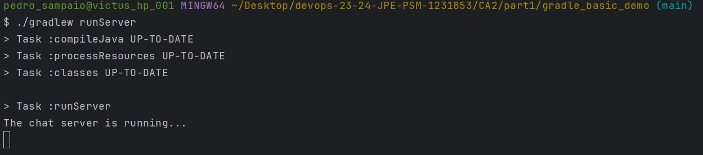
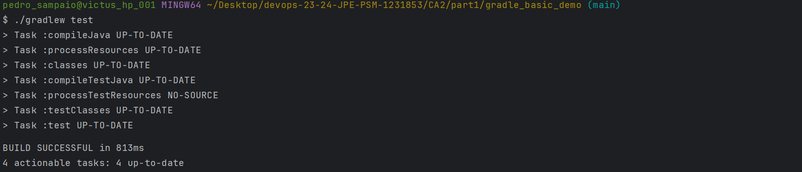
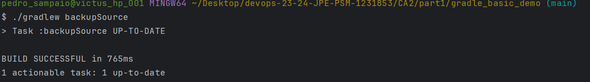
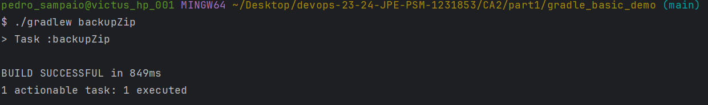

# CA2(Part 1) - Build Tools with Gradle
## Table of Contents

1. [CA2(Part 1) - Technical Report: Analysis and Implementation](#technical-report)
    - [Understanding the Gradle Basic Demo Application](#understanding-the-gradle-basic-demo-application)
    - [Add New Task to Execute the Server](#add-new-task-to-execute-the-server)
    - [Add Simple Unit Test and Update Dependencies](#add-simple-unit-test-and-update-dependencies)
    - [Add New Task of Type Copy](#add-new-task-of-type-copy)
    - [Add New Task of Type Zip](#add-new-task-of-type-zip)
    - [Conclusion](#conclusion)


## Technical Report

### Understanding the Gradle Basic Demo Application
#### Analysis
Gradle is a powerful build automation tool that simplifies and accelerates the
process of building, testing, and deploying software projects. It employs a declarative 
approach to project configuration, allowing developers to express their project's 
requirements and dependencies efficiently. With its flexibility and scalability, 
Gradle accommodates projects of varying sizes and complexities, offering advanced features 
such as dependency management, task automation, and multi-project support.

`Gradle Project`: The project is the highest-level construct representing the application 
you want to build, including the configuration of how to build it.


#### Gradle Project Files:

`settings.gradle` sets up some high-level configuration for the project, in our case the 
project name "basic_demo".

`build.gradle` is the build script configuration file describing the application to Gradle, 
so it can build it.

`gradle.properties` is a file where we can define properties that can be used in our
build script.

`/gradlew and gradlew.bat` are known as the Gradle wrapper scripts, for Linux/Mac and
Windows respectively. These let you build an application without having to download and 
install Gradle. When the wrapper is executed, it will automatically 
download Gradle and cache it locally.

`directory .gradle` is where Gradle stores its own files, like downloaded dependencies.

`directory build` is where Gradle puts the compiled classes and other build artifacts.

#### Gradle Build, Tasks and Plugins:

`Build script` Each Gradle project can have a build script, build.gradle, this is where we
tell Gradle about our application through configuration, and Gradle uses that 
information to build it.

Note:
`Groovy Language` Groovy is a language which, like Java, runs on the Java
Virtual Machine, the JVM. Groovy was chosen as the language for Gradle build scripts
because of its dynamic nature, allowing our build to be concisely configured using what’s
called the Gradle Groovy DSL (domain specific language). Writing Gradle build scripts
involves writing Groovy code, but doing it in a way that uses the Gradle APIs.

`Tasks` Gradle tasks are individual build actions we can run from the command line. We might 
have a task to compile our Java code, a task to test the code, and a task to 
package the compiled classes into a jar file and much more.
We can see a list of all the available tasks with the command `/gradlew tasks`.

`Plugins` Plugins in your build script, will automatically add tasks to the Gradle project 
which you can run to achieve some particular outcome. As a real-world example, the Gradle Java plugin  automatically adds tasks to compile, test, and package your application.


### Add New Task to Execute the Server
#### Analysis and Implementation

1. **Analysis:**
    - A new task `runServer` was created to execute the server.
    - The task was added to the `build.gradle` script configuration file.
    - The task was given the group `DevOps` and the description `Launches a chat server on localhost:59001`.
    - A command-line argument was also added to specify the port number `59001` to match the one in the `runClient` task.
    - The task was tested by running the command  `/gradlew runServer`.

 
2. **Implementation:**
```gradle
task runServer(type:JavaExec, dependsOn: classes) {
    group = "DevOps"
    description = "Launches a chat server on localhost:59001 "
    classpath = sourceSets.main.runtimeClasspath
    mainClass = 'basic_demo.ChatServerApp'
    args '59001'
}
```


### Add Simple Unit Test and Update Dependencies
#### Analysis and Implementation

1. **Analysis:**
   - A new test class `src/test/java/basic_demo/AppTest.java` was created to implement the provided test code.
   - The provided test code was implemented.
   - The necessary dependency was added to the `build.gradle` script configuration file.
   - This step was tested by running the command `/gradlew build` and `/gradlew test`.


2. **Implementation:**
```gradle
dependencies {
    // Use JUnit test framework
    testImplementation group: 'junit', name: 'junit', version: '4.12'
}
```


### Add New Task of Type Copy
#### Analysis and Implementation

1. **Analysis:**
   - A new task `backupSource` was created to copy the source files to a backup directory.
   - The task was added to the `build.gradle` script configuration file.
   - The task was given the group `DevOps` and the description `Copies the source files to a backup directory`.
   - The task was tested by running the command  `/gradlew backupSource`.


2. **Implementation:**
```gradle
task backupSource(type: Copy) {
    group = "DevOps"
    description = "Copies the source files to a backup directory"

    from 'src'
    into 'backup'
}
```


### Add New Task of Type Zip
#### Analysis and Implementation

1. **Analysis:**
   - A new task `backupZip` was created to copy and compress the source files to a backup directory.
   - The task was added to the `build.gradle` script configuration file.
   - The task was given the group `DevOps` and the description `Copies and compresses the source files to a backup directory`.
   - The task was tested by running the command  `/gradlew backupZip`.


2. **Implementation:**
```gradle
task backupZip(type: Zip) {
    group = "DevOps"
    description = "Copies and compresses the source files to a backup directory"

    from 'src'
    archiveFileName = "sources.zip"
    destinationDirectory = file("backup_zip")
}
```


### Conclusion
In conclusion, this assigment has provided an insightful exploration into the 
utilization of Gradle as a build automation tool within the context of a basic demo 
application. By dissecting the Gradle project structure and understanding its fundamental 
components such as build scripts, tasks, and plugins,
we gained a deeper understanding of how Gradle streamlines the build, test, and 
deployment processes. Through practical examples, we demonstrated the extension of the 
Gradle build process by adding custom tasks to execute the server, perform unit testing, 
and manage file operations like copying and compressing source files.
