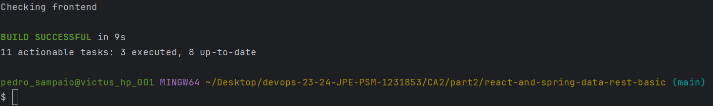
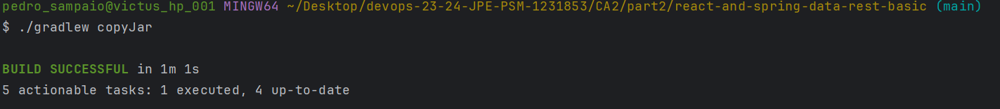
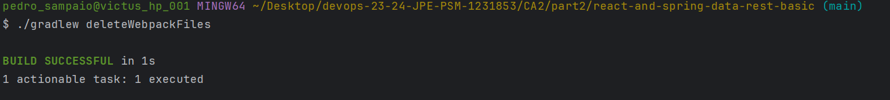
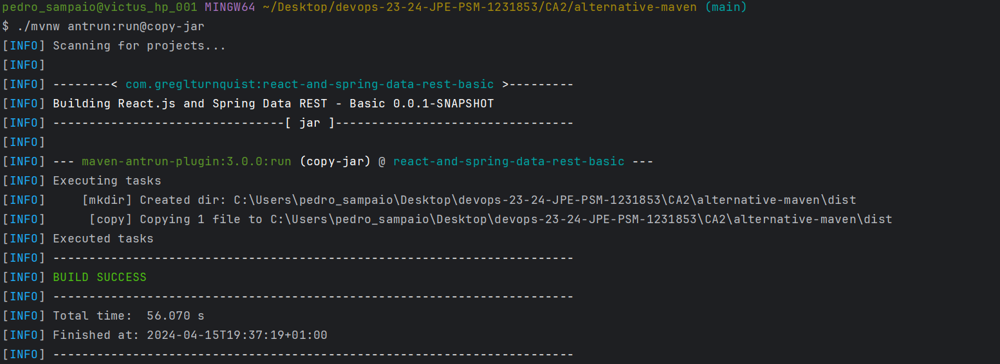
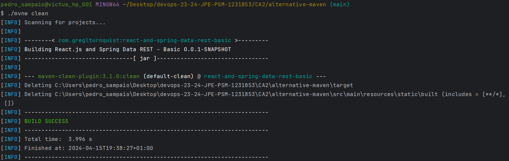

# CA2(Part 2) - Build Tools with Gradle

## Table of Contents

1. [CA2(Part 2) - Technical Report: Analysis and Implementation](#technical-report)
    - [Convert Maven Basic Demo Application into Gradle](#convert-maven-basic-demo-application-into-gradle)
    - [Add New Task to Copy the Generated Jar](#add-new-task-to-copy-the-generated-jar)
    - [Add New Task to Delete Files generated by Webpack](#add-new-task-to-delete-files-generated-by-webpack)
    - [Analysis of alternative to Gradle (Maven)](#analysis-of-alternative-to-gradle-maven)
    - [Conclusion](#conclusion)

## Technical Report

### Convert Maven Basic Demo Application into Gradle

#### Analysis and Implementation

1. **Creating a New Branch:**
    - Created a new branch named **tut-basic-gradle** in the repository to isolate changes for this part of the
      assignment.


2. **Setting up Gradle Project:**
    - Used Spring Initializr to create a new Gradle Spring Boot project with the required dependencies: **Rest
      Repositories**, **Thymeleaf**, **JPA**, and **H2**.
    - Extracted the generated zip file into the **CA2/Part2/** folder of the repository.


3. **Migrating Maven Code:**
    - Deleted the **src** folder in the Gradle project.
    - Copied the **src** folder and its subfolders from the basic Maven tutorial into the Gradle project folder.
    - Copied **webpack.config.js** and **package.json** files from the Maven project.
    - Deleted the **src/main/resources/static/built/** folder as it should be generated by webpack.


4. **Adding Frontend Plugin:**
    - Added the **org.siouan.frontend** Gradle plugin to manage frontend code.
    - Updated the **plugins** block in **build.gradle** according to the Java version being used.


5. **Configuring Frontend Plugin:**
    - Added configuration code in **build.gradle** to specify Node.js version and scripts for frontend tasks.


6. **Updating Package.json:**
    - Updated the **scripts** section in **package.json** to configure the execution of webpack.


7. **Building and Running:**
    - Executed **/gradlew build** to build the application, including frontend tasks.
    - Ran the application using **/gradlew bootRun**.



### Add New Task to Copy the Generated Jar

#### Analysis and Implementation

1. **Analysis:**
    - A new task `copyJar` was created to copy JAR files.
    - The task was configured to copy JAR files from the directory 'build/libs' into the directory 'dist'.
    - It was specified to include all JAR files using the pattern '*.jar'.
    - Dependency was established between the `copyJar` task and the `bootJar` task to ensure that JAR files are
      generated before copying.


2. **Implementation:**

```gradle
task copyJar(type: Copy) {
    from 'build/libs'
    into 'dist'
    include '*.jar'
}

copyJar.dependsOn bootJar
}
```



### Add New Task to Delete Files generated by Webpack

#### Analysis and Implementation

1. **Analysis:**
    - A new task `deleteWebpackFiles` was created to remove webpack-generated files.
    - The task was configured to delete files within the directory 'src/main/resources/static/built/'.
    - Dependency was established between the `clean` task and the `deleteWebpackFiles` task to ensure that webpack files
      are deleted before cleaning.

2. **Implementation:**

```gradle
task deleteWebpackFiles(type: Delete) {
    delete 'src/main/resources/static/built/'
}

clean.dependsOn deleteWebpackFiles
```



### Analysis of alternative to Gradle (Maven)

#### Analysis and Implementation

1. **Comparison with Gradle regarding build automation features:**

    - **Dependency Management:** Maven and Gradle both offer robust dependency management capabilities.
      Maven uses XML-based configuration (**pom.xml**), while Gradle uses Groovy or Kotlin DSL. Gradle's DSL might be
      considered more
      expressive and flexible, allowing for more complex dependency management scenarios.

    - **Plugin Ecosystem:** Both Maven and Gradle have extensive plugin ecosystems. Maven plugins are typically
      configured within the **pom.xml** file,
      while Gradle plugins are applied within the build script. Gradle's plugin system is often praised for its
      flexibility and ease of
      use, allowing developers to easily extend build functionality.

    - **Task Customization:** Maven's build lifecycle is more rigid compared to Gradle's task-based model.
      While Maven does offer some customization through plugin configuration, Gradle provides finer-grained control over
      tasks and their
      dependencies, making it more flexible for complex build scenarios.

    - **Community and Support:** Maven has been around longer than Gradle and has a large, mature community. It's widely
      adopted and well-documented. Gradle, while newer, has gained significant traction in recent years, particularly in
      the
      Android development community. Both have active support communities and frequent updates.

2. **How Maven could be used to solve the same goals:**

   To achieve the same goals as the assignment using Maven, we would:

    - **Project Setup:** Create a Maven project by generating a **pom.xml** file with the necessary configurations,
      including project metadata, dependencies, and plugins.

    - **Dependency Management:** Define project dependencies in the **pom.xml** file, specifying the required libraries
      and their versions. Maven will automatically download and manage these dependencies.

    - **Build Automation:** Define build phases and goals within the **pom.xml** file to specify the tasks to be
      executed during
      the build process. Maven's build lifecycle consists of phases like compile, test, package, install, and deploy.

    - **Customization:** Extend Maven's functionality by incorporating custom plugins. Maven plugins can be developed
      using Java and
      configured within the **pom.xml** file to perform specific tasks or integrate with external tools.


3. **Implementing the alternative design with Maven:**

   To implement the alternative design using Maven, you would follow these steps:

    - **Project Setup:** Create a Maven project structure and initialize a **pom.xml** file with project metadata.

    - **Dependency Management:** Define dependencies for the project, including any required libraries or external
      components.

    - **Plugin Integration:** Utilize existing Maven plugins or develop custom plugins to extend the build process as
      needed.
      Plugins can be configured in the **pom.xml** file to execute tasks such as compiling code, running tests,
      packaging artifacts, and deploying applications.

    - **Customization:** Customize the build process by configuring plugins and defining build goals in the **pom.xml**
      file. Maven's lifecycle
      and plugin architecture provide flexibility for extending functionality to meet specific requirements.


      Task to Copy Generated Jar:

```xml
<plugin>
    <groupId>org.apache.maven.plugins</groupId>
    <artifactId>maven-antrun-plugin</artifactId>
    <version>3.0.0</version>
    <executions>
        <execution>
            <id>copy-jar</id>
            <phase>none</phase>
            <goals>
                <goal>run</goal>
            </goals>
            <configuration>
                <target>
                    <mkdir dir="${project.basedir}/dist"/>
                    <copy file="${project.build.directory}/${project.build.finalName}.jar"
                          todir="${project.basedir}/dist"/>
                </target>
            </configuration>
        </execution>
    </executions>
</plugin>
```



      Task to Delete Files Generated by Webpack:

```xml
<plugin>
   <artifactId>maven-clean-plugin</artifactId>
   <version>3.1.0</version>
   <configuration>
      <filesets>
         <fileset>
            <directory>src/main/resources/static/built</directory>
            <includes>
               <include>**/*</include>
            </includes>
         </fileset>
      </filesets>
   </configuration>
</plugin>
```



In summary, while Maven and Gradle share many similarities in terms of build automation, they differ in their approach
to project configuration,
dependency management, and build customization. Maven's XML-based configuration and predefined build lifecycle make it a
reliable choice for many
projects, although Gradle's flexibility and extensibility may offer advantages in more complex build scenarios.
Ultimately, the choice between Maven
and Gradle depends on factors such as project requirements, developer preferences, and existing ecosystem
considerations.

### Conclusion

In conclusion, this assignment has offered a comprehensive exploration of Gradle's capabilities as a powerful build
automation tool in the
context of a basic demo application. By delving into the Gradle project structure and unraveling its core elements such
as build scripts, tasks,
and plugins, we have gained valuable insights into how Gradle simplifies the build, test, and deployment workflows.
Through practical demonstrations,
we showcased the flexibility of Gradle by seamlessly integrating frontend tasks, managing dependencies, and customizing
build processes with ease.

Furthermore, by comparing Gradle with its counterpart Maven, we highlighted the strengths and nuances of each build
automation tool. While Maven
boasts a mature ecosystem and a structured build lifecycle, Gradle excels in its flexibility, expressiveness, and
task-based approach, making it
an attractive choice for modern software projects.
