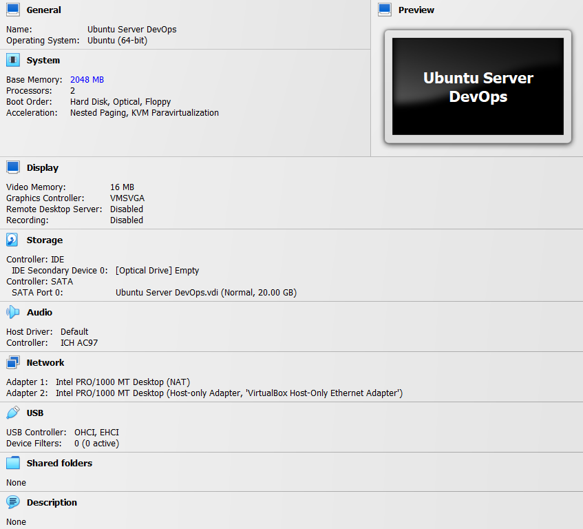
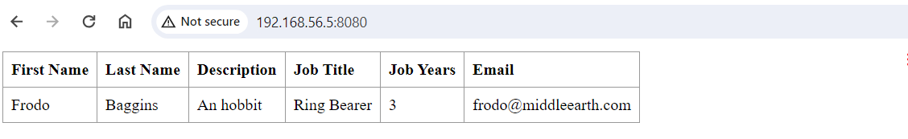
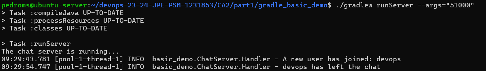
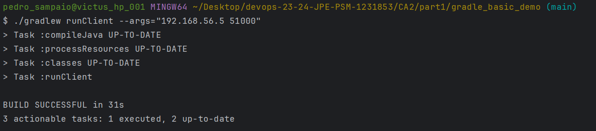

# CA3(Part 1) - Virtualization with Vagrant

## Table of Contents

1. [CA3(Part 1) - Technical Report: Analysis and Implementation](#technical-report)
    - [Creating a Virtual Machine (Virtual Box)](#creating-a-virtual-machine-virtual-box)
    - [Cloning the Repository](#cloning-the-repository)
    - [Building and Executing the Maven Spring Boot Tutorial Basic Project](#building-and-executing-the-maven-spring-boot-tutorial-basic-project)
    - [Building and Executing the Gradle Basic Demo Project](#building-and-executing-the-gradle-basic-demo-project)
    - [Conclusion](#conclusion)

## Technical Report

### Creating a Virtual Machine (Virtual Box)

#### Analysis and Implementation

1. **Install Virtual Box:**
    - Downloaded and installed Virtual Box from the official website. The installation process was straightforward and
      completed without any issues.


2. **Create/Configure a new Ubuntu-Server Virtual Machine:**
    - Created a new Virtual Machine in Virtual Box using the Ubuntu-Server(22.04.3) ISO image.
    - Created a Host-Only network adapter to allow communication between the host machine and the VM.
    - Added a fixed IP address to the VM to ensure consistent network connectivity.


3. **Install necessary Tools:**
    - Installed Git:
   ```bash
    sudo apt update
    sudo apt install git
    ```
    - Installed OpenSSH Server:
    ```bash
    sudo apt install openssh-server
    ```
    - Installed Java 8 and 17:

   Installed both Java 8 and Java 17 in headless mode there was no need for a graphical interface (17 is only necessary
   because I wanted to test CA2/part2 project).
    ```bash
    sudo apt install openjdk-8-jdk-headless
    sudo apt install openjdk-17-jdk-headless
    ```



### Cloning the Repository

#### Analysis and Implementation

1. **Analysis:**
    - Created a new SSH key on the VM to establish a secure connection with the GitHub repository.
    - Cloned the repository using the SSH URL to download the project files to the VM.

   Alternatively, the repository could be cloned using the HTTPS URL, but the SSH method is more secure and convenient
   for authentication and the repository needs to be public to clone using HTTPS.

2. **Implementation:**

```bash
ssh-keygen -t ed25519 -C "email@example.com"
git clone git@github.com:example.git
```

### Building and Executing the Maven Spring Boot Tutorial Basic Project

#### Analysis and Implementation

1. **Analysis:**
    - Once the repository was cloned, the Spring Boot Tutorial Basic project was built and executed on the VM.
    - For this I used the Maven Wrapper to build and run the project, which simplifies the process by ensuring that the
      correct version of Maven is used.
    - It was necessary to give execute permissions to the Maven Wrapper script before running it.

   After running the Maven Wrapper script, the project was built and the server was started and tested through the host
   machine.

2. **Implementation:**

```bash
cd devops-23-24-JPE-PSM-1231853/CA1/basic/

chmod +x mvnw
./mvnw clean package
./mvnw spring-boot:run
```



### Building and Executing the Gradle Basic Demo Project

#### Analysis and Implementation

1. **Analysis:**
    - Once the repository was cloned, the Gradle Basic Demo project was built and executed on the VM.
    - For this I used the Gradle Wrapper to build and run the project, which simplifies the process by ensuring that the
      correct version of Gradle is used.
    - It was necessary to give execute permissions to the Gradle Wrapper script before running it.

   After running the Gradle Wrapper script, the project was built and the server was started and tested through the host
   machine.

2. **Implementation:**

```bash
cd devops-23-24-JPE-PSM-1231853/CA2/part1/gradle_basic_demo/

chmod +x gradlew
./gradlew build
```

Runned both the Client and Server applications with the following commands to explicitly declare the command line
arguments for the IP Address and Port Number.

```bash
./gradlew runServer --args="51000"
```



```bash
 ./gradlew runClient --args="192.168.56.5 51000"
```



### Conclusion

In conclusion, the Virtual Machine was successfully created and configured with the necessary tools to clone the
repository and build and execute the Maven Spring Boot Tutorial Basic and Gradle Basic Demo projects. The projects were
built and executed without any issues, and the server was tested through the host machine. The Virtual Machine was
successfully set up and the projects were successfully built and executed.
