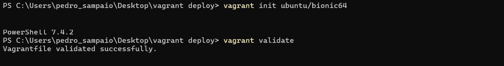
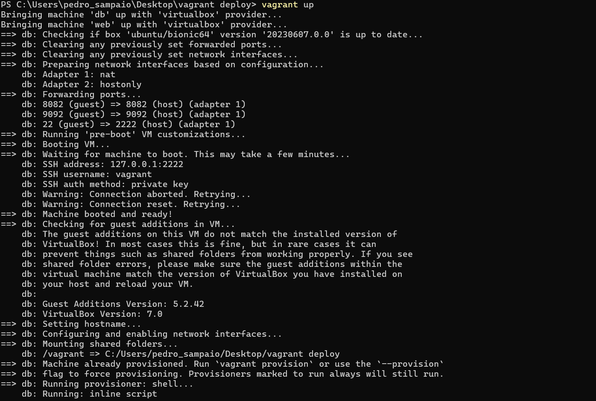
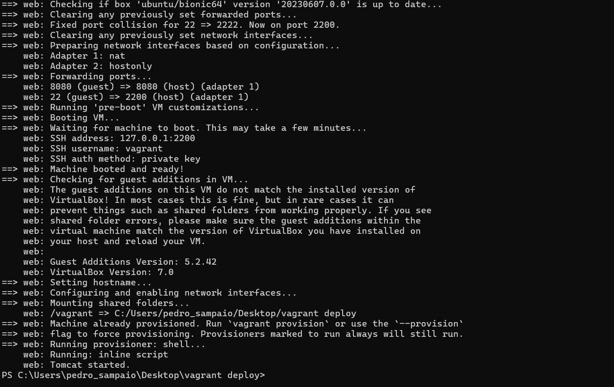
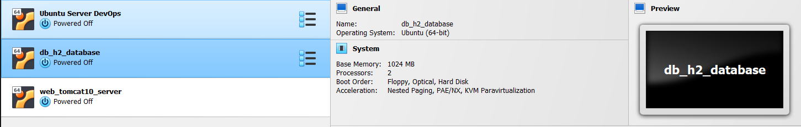
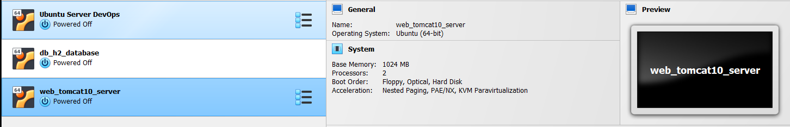
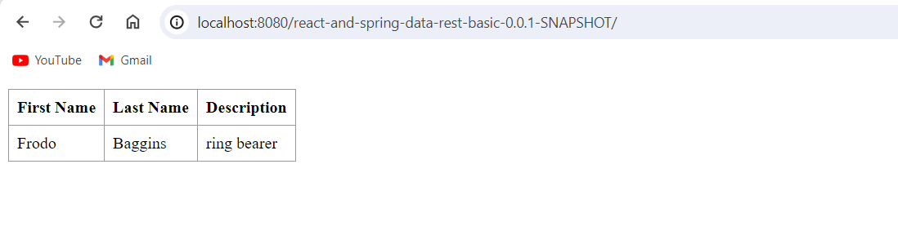
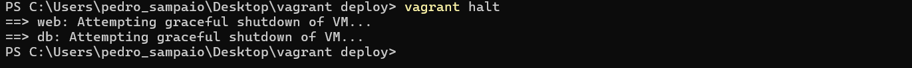
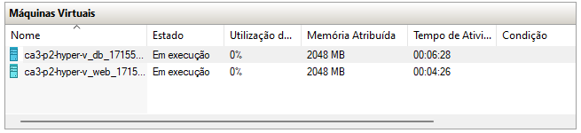
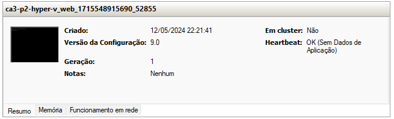
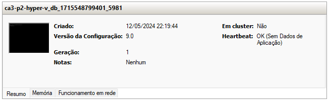

# CA3(Part 2) - Virtualization with Vagrant

## Table of Contents

1. [CA3(Part 2) - Technical Report: Analysis and Implementation](#technical-report)
    - [Analysis of Vagrant](#analysis-of-vagrant)
    - [Updating Basic Gradle Project](#updating-basic-gradle-project)
    - [Updating Vagrant File](#updating-vagrant-file)
    - [Testing Vagrant File](#testing-vagrant-file)
    - [Alternative Solution to Virtual Box (Hyper-V)](#alternative-solution-to-virtual-box-hyper-v)
    - [Conclusion](#conclusion)

## Technical Report

### Analysis of Vagrant

1. **Vagrant:**
    - Vagrant is a tool for building and managing virtual machine environments in a single workflow.
    - It provides easy-to-use and consistent development environments that can be shared across different machines.
    - Vagrant uses a configuration file called Vagrantfile to define the settings for the virtual machines.


2. **Vagrantfile:**
    - The Vagrantfile is a Ruby script that defines the configuration settings for the virtual machines.
    - It specifies the base box, network settings, synced folders, and provisioning scripts for the virtual machines.


3. **Analysis of the Example Vagrantfile:**
    - The Vagrantfile defines the configuration settings for two virtual machines.
    - It specifies the base box as "ubuntu/focal64".
    - Both virtual machines install the necessary packages and tools using the shell provisioner.
    - They also both install Java 11 in headless mode.
    -
        -
    - The first virtual machine is configured as a database server using an H2 database server.
    - It defines a private network IP address and forwards ports for accessing the H2 console and server from the
      host machine.
    - Uses the shell provisioner to download the H2 database server and run it in the background.
    - The database is launched using a always run shell provisioner to ensure that the H2 server is always running.
    -
        -
    - The second virtual machine is configured as a web server using Tomcat 9.
    - It defines a private network IP address and forwards ports for accessing the web server from the host machine.
    - Clones the repository and builds the tut-basic-gradle project using the gradle wrapper.
    - After building the project the war file is deployed to the Tomcat web server.

### Updating Basic Gradle Project

#### Analysis and Implementation

1. **Analysis:**

- In order for the Basic Gradle Project from CA2: Part2 to work with the Vagrantfile and to be able to connect
  to an H2 database server, the project needed to be updated.
- The project was updated to include the necessary dependencies for connecting to an H2 database server and to
  be able to be deployed to a Tomcat web server.


2. **Implementation:**

- Updated the necessary dependencies to the build.gradle file to build a war file to be deployed to a Tomcat web
  server.

```gradle
plugins {
    id 'war'
}

dependencies {
    // To support war file for deploying to tomcat
    providedRuntime 'org.springframework.boot:spring-boot-starter-tomcat'
}
```

- Implemented a ServletInitializer class to configure the application to be run in a Servlet container.

```java
package com.greglturnquist.payroll;

import org.springframework.boot.builder.SpringApplicationBuilder;
import org.springframework.boot.web.servlet.support.SpringBootServletInitializer;

public class ServletInitializer extends SpringBootServletInitializer {

    @Override
    protected SpringApplicationBuilder configure(SpringApplicationBuilder application) {
        return application.sources(ReactAndSpringDataRestApplication.class);
    }

}
```

- Updated the app.js and index.html files to include the necessary changes for the frontend to work with the
  updated project.

```javascript
componentDidMount()
{ // <2>
    client({method: 'GET', path: '/react-and-spring-data-rest-basic-0.0.1-SNAPSHOT/api/employees'}).done(response => {
        this.setState({employees: response.entity._embedded.employees});
    });
}
```

```html

<link rel="stylesheet" href="main.css"/>
```

- Finally, updated the application.properties file to include the necessary configuration settings for connecting to
  the defined H2 database server.

```properties
spring.data.rest.base-path=/api
server.servlet.context-path=/react-and-spring-data-rest-basic-0.0.1-SNAPSHOT
spring.datasource.url=jdbc:h2:tcp://192.168.56.11:9092/./jpadb;DB_CLOSE_DELAY=-1;DB_CLOSE_ON_EXIT=FALSE
spring.datasource.driverClassName=org.h2.Driver
spring.datasource.username=sa
spring.datasource.password=
spring.jpa.database-platform=org.hibernate.dialect.H2Dialect
spring.jpa.hibernate.ddl-auto=update
spring.h2.console.enabled=true
spring.h2.console.path=/h2-console
spring.h2.console.settings.web-allow-others=true
```

### Updating Vagrant File

#### Analysis and Implementation

1. **Analysis:**

- In order to deploy the Basic Gradle Project to a Tomcat web server, and to connect the project to an H2 database
  server, the Vagrantfile needed to be updated.
- The Vagrantfile was updated to include the necessary configuration settings for the virtual machines to work with
  Java 17 and Tomcat 10.

2. **Implementation:**

- Updated the configuration settings for both virtual machines to install JAVA 17 in headless mode.
- Necessary to work with CA2: Part2 Basic Gradle Project, and Spring Boot 3.2.4.

```ruby
# This provision is common for both VMs
    config.vm.provision "shell", inline: <<-SHELL
        sudo apt-get update -y
        sudo apt-get install -y iputils-ping avahi-daemon libnss-mdns unzip \
            openjdk-17-jdk-headless
    SHELL
```

- Updated the configuration settings for the H2 database server virtual machine to use the most recent update of H2
  server(2.2.224) in order to correctly work with Spring-Boot 3.2.4.

```ruby
# We need to download H2
    db.vm.provision "shell", inline: <<-SHELL
        wget https://repo1.maven.org/maven2/com/h2database/h2/2.2.224/h2-2.2.224.jar 
    SHELL
```

- Updated the configuration settings for the Tomcat web server virtual machine to use Tomcat 10 (instead of 9) in
  order to
  correctly
  work with Spring-Boot 3.2.4.
- The Tomcat 10 server is downloaded and extracted to the current directory, and the necessary permissions are set
  to execute the server.
- The Tomcat 10 server is started using a shell provisioner that runs always to ensure that the server is always
  running(similar to the H2 database server).

```ruby
# We need to download Tomcat10
    web.vm.provision "shell", inline: <<-SHELL
        wget https://dlcdn.apache.org/tomcat/tomcat-10/v10.1.23/bin/apache-tomcat-10.1.23.tar.gz
        sudo tar xzvf apache-tomcat-10*tar.gz -C .
        sudo chown -R vagrant:vagrant apache-tomcat-10*
        sudo chmod -R u+x apache-tomcat-10* 
    SHELL

# The following provision shell will run ALWAYS so that we can execute the Tomcat10 server process
# This could be done in a different way, for instance, setting Tomcat10 as as service
#
    web.vm.provision "shell", :run => 'always', inline: <<-SHELL
        ./apache-tomcat-10*/bin/startup.sh
    SHELL
```

- Updated the configuration settings to correctly clone the repository, build and deploy the Basic Gradle
  Project to the Tomcat web server.

```ruby
# Clone the repository and build the project
    web.vm.provision "shell", inline: <<-SHELL, privileged: false
        git clone https://github.com/Pedro-M-S/devops-23-24-JPE-PSM-1231853.git
        cd devops-23-24-JPE-PSM-1231853/CA3/part2/react-and-spring-data-rest-basic
        chmod u+x gradlew
        ./gradlew clean build

# To deploy the war file to tomcat10 do the following command:
        sudo cp ./build/libs/react-and-spring-data-rest-basic-0.0.1-SNAPSHOT.war ~/apache-tomcat-10*/webapps/
    SHELL
```

### Testing Vagrant File

#### Analysis and Implementation

1. **Analysis:**

- In order to test the Vagrantfile, several commands were used:
- `vagrant init "boxname"` - to create a new Vagrantfile.
- `vagrant validate` - to validate the Vagrantfile.
- `vagrant up` - to start the virtual machines.
- `vagrant halt` - to stop the virtual machines.
- `vagrant -f destroy` - to delete the virtual machines.
- `vagrant ssh` - to connect to the virtual machines.

2. **Implementation:**









### Alternative Solution to Virtual Box (Hyper-V)

#### Analysis and Implementation

1. **Analysis:**

- As an alternative to using Virtual Box, Vagrant can be used with other providers such as Hyper-V.
- Hyper-V is a native hypervisor that can be used to create and manage virtual machines on Windows. It provides a 
  lightweight and efficient way to run virtual machines on Windows.
- In order to use Hyper-V with Vagrant, the Vagrantfile needed to be updated to use the Hyper-V provider.


2. **Implementation:**

- In order to use Hyper-V as the provider a plugin is needed to be installed:
```bash
vagrant plugin install vagrant-hyperv
```

- In order to run the Vagrantfile with Hyper-V as the provider, the following command was used:
```bash
vagrant up --provider=hyperv
```

- The Vagrantfile was updated to use the Hyper-V provider
- First removed everything related to Virtual Box and then added the Hyper-V provider configuration settings below:


- Both machines were configured with more memory and CPU resources to improve performance and linked clones was used
  to speed up VM creation.
- Linked clones is a feature of Hyper-V that allows you to create a new virtual machine that shares the same virtual
  hard disk as an existing virtual machine.

```ruby
# Specify Hyper-V as the provider for each VM
  config.vm.provider "hyperv" do |h|
    h.cpus = 2
    h.memory = 2048
    # Use linked clones to speed up VM creation
    h.linked_clone = true
  end
  ```




### Conclusion

In conclusion, the Vagrantfile was successfully updated to work with the Basic Gradle Project from CA2: Part2.
The project was updated to include the necessary dependencies for connecting to an H2 database server and to be
deployed to a Tomcat web server.
The Vagrantfile was tested using several commands to validate and start the virtual machines.
The virtual machines were successfully started, and the Basic Gradle Project was deployed to the Tomcat web server.

Additionally, an alternative solution to using Virtual Box was explored by using Hyper-V as the provider for Vagrant.
The Vagrantfile was updated to use the Hyper-V provider, and the virtual machines were successfully started using
Hyper-V.