# CA4(Part 1) - Containers with Docker

## Table of Contents

1. [CA4(Part 1) - Technical Report: Analysis and Implementation](#technical-report)
    - [Docker](#docker)
    - [Creating a Dockerfile and Building an Image (Version 1)](#creating-a-dockerfile-and-building-an-image-version-1)
    - [Creating a Dockerfile and Building an Image (Version 2)](#creating-a-dockerfile-and-building-an-image-version-2)
    - [Conclusion](#conclusion)

## Technical Report

### Docker

Docker is a powerful tool designed to simplify the process of creating, deploying, and managing
applications by using containers.


- **Containers:** Docker utilizes containers, which are lightweight, portable, and isolated environments 
for running applications and their dependencies. Containers package the application code, runtime, 
system tools, libraries, and settings, ensuring consistency across different environments.


- **Images:** Docker images are the blueprints for containers. They contain everything needed to run an 
application, including the code, dependencies, runtime, and system libraries. Images are built from 
Dockerfiles, which are text files that specify the steps needed to create the image.


- **Dockerfile:** Dockerfile is a text file that contains instructions for building Docker images. 
It specifies the base image, software packages, environment variables, and other configurations 
needed for the application. Dockerfiles enable developers to automate the process of building 
consistent and reproducible images.


- **Docker Engine:** The Docker Engine is the core component of Docker. It is a client-server 
application that runs on the host operating system and manages containers. It includes a daemon 
process called dockerd, a REST API for interacting with the daemon, and a command-line interface (CLI)
for interacting with Docker.


- **Docker Hub:** Docker Hub is a cloud-based registry service provided by Docker, where users can find, 
store, and distribute Docker images. It hosts a vast repository of public images contributed by the 
community, as well as private repositories for organizations.

### Creating a Dockerfile and Building an Image (Version 1)

#### Analysis and Implementation

1. **Analysis:**
    - Create a Multi-Stage Dockerfile for the Gradle Basic Demo project from CA2.
    - The Dockerfile will use a multi-stage build to compile the project in one stage and run the compiled 
      application in another stage.
    - Use a base image with the Gradle version of the project and JDK to build the project.
    - Expose the port used by the application to allow external access.
    - Define the entry point for the container to run the chat server application when the container starts.

The command to build the Docker image from the project root directory:

The `-f` flag specifies the path to the Dockerfile, the `-t` flag specifies the name and tag for the image and `.` 
specifies the build context. The build context is important for the `COPY` instruction to work correctly.

`docker build -f CA4/part1/version1/Dockerfile -t chat-server-v1:latest .`

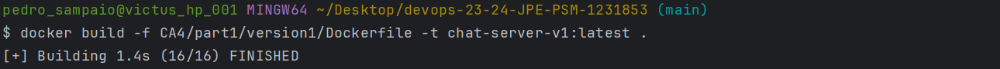

The command to run the Docker container from the built image:

The `-p` flag specifies the port mapping between the host and container and the `--name` 
flag specifies the name of the container.

`docker run -p 59001:59001 --name chat-server-v1 chat-server-v1`

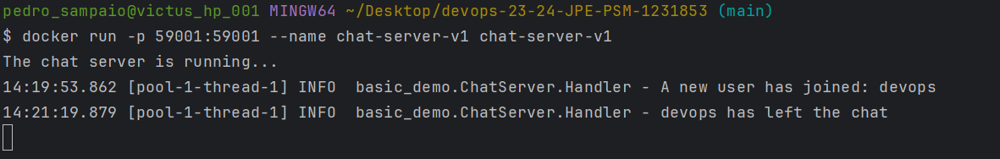

2. **Implementation:**

```dockerfile
FROM gradle:7.4.1-jdk17 AS builder
FROM openjdk:17-slim AS runner

FROM builder AS build
WORKDIR /app
COPY CA2/part1/gradle_basic_demo/build.gradle CA2/part1/gradle_basic_demo/settings.gradle /app/
COPY CA2/part1/gradle_basic_demo/src /app/src/
RUN gradle build --no-daemon

FROM runner AS final
EXPOSE 59001
WORKDIR /app
COPY --from=build /app/build/libs/basic_demo-0.1.0.jar basic_demo-0.1.0.jar

ENTRYPOINT java -cp basic_demo-0.1.0.jar basic_demo.ChatServerApp 59001
```
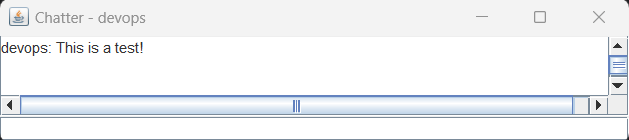


3. **Pushing the Docker Image to Docker Hub:**

To push the Docker image to Docker Hub, the image needs to be tagged with the Docker Hub username and repository name.

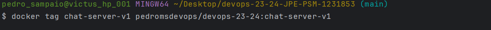
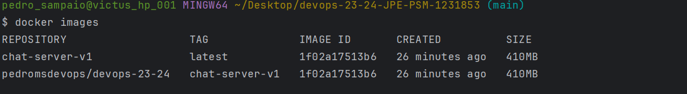
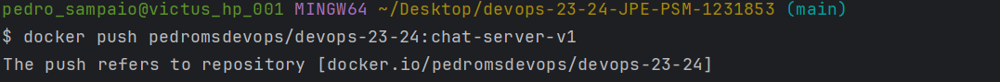


### Creating a Dockerfile and Building an Image (Version 2)

#### Analysis and Implementation

1. **Analysis:**
   - First build the Gradle Basic Demo project from CA2.
   - Second copy the built JAR file to the final image.
   - Important to use the correct base image with a JDK above the version used to build the project.
   - Expose the port used by the application to allow external access.
   - Define the entry point for the container to run the chat server application when the container starts.

The command to build the Docker image from the project root directory:

The `-f` flag specifies the path to the Dockerfile, the `-t` flag specifies the name and tag for the image and `.`
specifies the build context. The build context is important for the `COPY` instruction to work correctly.

`docker build -f CA4/part1/version2/Dockerfile -t chat-server-v2:latest .`

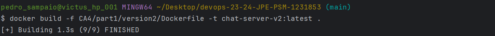

The command to run the Docker container from the built image:

The `-p` flag specifies the port mapping between the host and container and the `--name`
flag specifies the name of the container.

`docker run -p 59001:59001 --name chat-server-v2 chat-server-v2`

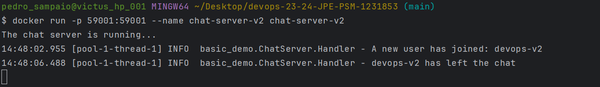

2. **Implementation:**

```dockerfile
FROM openjdk:21-slim AS base

FROM base AS final
EXPOSE 59001
WORKDIR /app
COPY CA2/part1/gradle_basic_demo/build/libs/basic_demo-0.1.0.jar basic_demo-0.1.0.jar

ENTRYPOINT java -cp basic_demo-0.1.0.jar basic_demo.ChatServerApp 59001
```

3. **Pushing the Docker Image to Docker Hub:**

To push the Docker image to Docker Hub, the image needs to be tagged with the Docker Hub username and repository name.

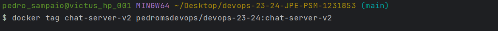
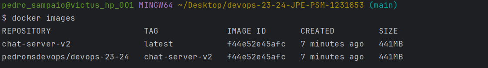
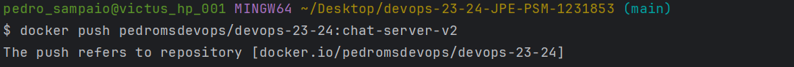
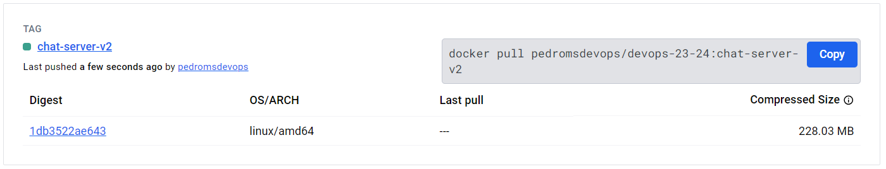

### Conclusion

In conclusion, Docker is a powerful tool that simplifies the process of creating, deploying, and managing applications
by using containers. Dockerfiles enable developers to automate the process of building consistent and reproducible images.
By creating Docker images for the Gradle Basic Demo project from CA2, we demonstrated how to use multi-stage builds to
compile and run the application in separate stages. We also explored how to push the Docker images to Docker Hub for
sharing and distribution. Overall, Docker provides a flexible and efficient way to package and deploy applications in
a consistent and portable manner.
