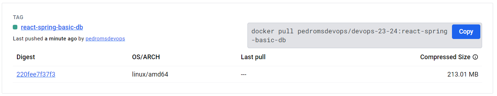

# CA4(Part 2) - Containers with Docker

## Table of Contents

1. [CA4(Part 2) - Technical Report: Analysis and Implementation](#technical-report)
    - [Docker Compose](#docker-compose)
    - [Dockerfile for the H2 Database Server](#dockerfile-for-the-h2-database-server)
    - [Dockerfile for the Tomcat Web Server](#dockerfile-for-the-tomcat-web-server)
    - [Docker Compose Configuration](#docker-compose-configuration)
    - [H2 Volume Configuration](#h2-volume-configuration)
    - [Conclusion](#conclusion)

## Technical Report

### Docker Compose

Docker Compose is a tool used for defining and running multi-container Docker applications. It allows you to manage 
complex applications that require multiple interconnected services, such as a web server and a database, all of 
which need to work together.


- **Service:** A service represents a container in your application. Each service runs a specific image and
can be configured with environment variables, volumes, networks, and other options.


- **Project:** A project is a collection of services that are defined in a docker-compose.yml file.


- **Volume:** Volumes are used to persist data generated by and used by Docker containers. 
Volumes are managed by Docker and can be shared among multiple containers.


- **Network:** Networks allow containers to communicate with each other. Docker Compose creates a 
default network for all services defined in the docker-compose.yml file, but you can also define custom networks.

### Dockerfile for the H2 Database Server

#### Analysis and Implementation

1. **Analysis:**
    - Create a Multi-Stage Dockerfile for the H2 Database Server.
    - Use a base image with the desired JDK to build and run the H2 Database Server.
    - Download the H2 Database Server JAR file using the wget command.
    - Copy the downloaded JAR file to the final image.
    - Expose the ports used by the application to allow external access and TCP connections.
    - Set the entry point to run the H2 Database Server with the necessary options.


2. **Implementation:**

```dockerfile
FROM openjdk:17-slim AS base

FROM base AS build
WORKDIR /app
RUN apt-get update && apt-get install -y wget
RUN wget https://repo1.maven.org/maven2/com/h2database/h2/2.2.224/h2-2.2.224.jar

FROM base AS final
EXPOSE 8082
EXPOSE 9092
COPY --from=build /app/h2-2.2.224.jar h2-2.2.224.jar

ENTRYPOINT java -cp h2-2.2.224.jar org.h2.tools.Server -web -webAllowOthers -tcp -tcpAllowOthers -ifNotExists
```

### Dockerfile for the Tomcat Web Server

#### Analysis and Implementation

1. **Analysis:**
    - Create a Multi-Stage Dockerfile for the Tomcat Web Server.
    - Use a base image with the Gradle and JDK version of the project to build the project.
    - Copy the project files to the container and build the project using Gradle.
    - Use the Tomcat base image to run the application.
    - Expose the port used by the application to allow external access.
    - Copy the compiled WAR file to the Tomcat webapps directory to deploy the application.


2. **Implementation:**

```dockerfile
FROM gradle:8.7-jdk17 AS builder
FROM tomcat:10-jdk17 AS runner

FROM builder AS build
WORKDIR /app
COPY CA3/part2/react-and-spring-data-rest-basic/build.gradle /app/
COPY CA3/part2/react-and-spring-data-rest-basic/settings.gradle /app/
COPY CA3/part2/react-and-spring-data-rest-basic/package.json /app/
COPY CA3/part2/react-and-spring-data-rest-basic/webpack.config.js /app/
COPY CA3/part2/react-and-spring-data-rest-basic/src /app/src/
RUN gradle build --no-daemon

FROM runner AS final
EXPOSE 8080
WORKDIR /app
COPY --from=build /app/build/libs/react-and-spring-data-rest-basic-0.0.1-SNAPSHOT.war /usr/local/tomcat/webapps/
```

### Docker Compose Configuration

#### Analysis and Implementation

1. **Analysis:**
    - Create a Docker Compose configuration file to define the services for the H2 Database Server and Tomcat Web Server.
    - Define the services for the H2 Database Server and the Tomcat Web Server with their respective Dockerfiles.
    - Configure the network settings for the services to allow communication between the containers.
    - Define a volume for the H2 Database Server to persist the data.
    - Expose the necessary ports used by the services to allow external access.
    - Define the dependencies between the services to ensure that the H2 Database Server is started before the Tomcat Web Server.

It's import to define the context and dockerfile to build the images for the services in order for the `COPY` 
instruction to work correctly from the root project.

The command to build the docker-compose configuration file from the project root directory:

The `-f` flag specifies the path to the docker-compose configuration file and the `-p` 
flag specifies the project name. 

`docker-compose -f CA4/part2/docker-compose.yml -p react-spring-basic build`


The command to run the docker-compose configuration file from the project root directory:

The `-f` flag specifies the path to the docker-compose configuration file and the `-p` 
flag specifies the project name.

`docker-compose -f CA4/part2/docker-compose.yml -p react-spring-basic up`


2. **Implementation:**

```yml
version: '3'
services:
  web:
    container_name: tomcat-web
    build:
      context: ../../
      dockerfile: CA4/part2/web/Dockerfile
    ports:
      - "8080:8080"
    networks:
      default:
        ipv4_address: 192.168.56.10
    depends_on:
      - "db"

  db:
    container_name: h2-database
    build:
      context: ../../
      dockerfile: CA4/part2/db/Dockerfile
    volumes:
      - h2-data:/data
    ports:
      - "8082:8082"
      - "9092:9092"
    networks:
      default:
        ipv4_address: 192.168.56.11

networks:
  default:
    ipam:
      driver: default
      config:
        - subnet: 192.168.56.0/24

volumes:
  h2-data:
```


3. **Pushing the Docker Image to Docker Hub:**

To push the Docker image to Docker Hub, the image needs to be tagged with the Docker Hub username and repository name.





### H2 Volume Configuration

#### Analysis and Implementation

1. **Analysis and Implementation:**
    - In order to persist the data generated by the H2 Database Server, we configured a volume in the Docker Compose file.
    - Volumes are used to store data generated by and used by Docker containers.

To create a backup of the H2 Database, we can copy the database files from the volume to the host machine. We will 
use an `exec` command to copy the database files from the volume to the host machine.

`docker exec -it h2-database sh`

`cp jpadb.mv.db /data`


### Conclusion

In conclusion, Docker Compose is a powerful tool that allows you to define and run multi-container Docker applications
with ease. By defining services, volumes, and networks in a docker-compose.yml file, you can manage complex applications
that require multiple interconnected services, such as a web server and a database. In this project, we used Docker Compose
to define services for the H2 Database Server and the Tomcat Web Server, and configured volumes and networks to persist data
and allow communication between the containers. We also demonstrated how to build and run the services using Docker Compose
and how to push the Docker images to Docker Hub. Overall, Docker Compose is a valuable tool for managing multi-container
Docker applications and simplifying the deployment process.
