# CA5 - CI/CD Pipelines with Jenkins

## Table of Contents

1. [CA5 - Technical Report: Analysis and Implementation](#technical-report)
    - [Jenkins](#jenkins)
    - [Gradle Basic Demo - Pipeline](#gradle-basic-demo---pipeline)
    - [Gradle React and Spring Data Rest Basic - Pipeline](#gradle-react-and-spring-data-rest-basic---pipeline)
    - [Conclusion](#conclusion)

## Technical Report

### Important Note

The Jenkinsfile and Dockerfile files implemented in this CA5 are located in the CA2/part1/gradle_basic_demo
and CA2/part2/gradle_react_spring_data_rest_basic directories.

### Jenkins

Jenkins is an open-source automation server widely used for Continuous Integration (CI) and Continuous Delivery (CD).
It supports building, deploying, and automating software development projects, allowing teams to integrate changes more
frequently and deliver products faster and more reliably.

Jenkins provides a web-based user interface that allows users to configure and manage the automation server, create and
manage jobs, and view build logs and reports. It also supports a wide range of plugins that extend its functionality and
integrate with other tools and services.

**Installation:**

- Jenkins can be installed on various operating systems, including Windows, macOS, and Linux.
- The installation process involves downloading the Jenkins WAR file and running it using Java.
- Jenkins can also be installed using Docker, which simplifies the installation process and provides a more
  consistent environment.

**Configuration:**

- Jenkins can be configured using the web-based user interface, which allows users to set up global configurations,
  manage users and permissions, and install plugins.

**Jobs:**

- Jenkins's jobs are used to define the steps that Jenkins will execute to build, test, and deploy software projects.
- Jobs can be configured to run on specific triggers, such as code commits, time-based schedules, or manual execution.

**Pipelines:**

- Jenkins's pipelines are used to define the entire build process as code, allowing users to version control and
  automate the build, test, and deployment steps.

**Jenkinsfile:**

- A Jenkinsfile is a text file that defines the entire build process as code. It includes the stages, steps, and
  configurations necessary to build, test, and deploy the project.
- Jenkinsfiles can be written in declarative or scripted syntax, depending on the complexity and requirements of
  the build process.

### Gradle Basic Demo - Pipeline

### Analysis and Implementation

### Analysis

### Jenkins Configuration

Jenkins can be installed and run using Docker. The following command can be used to run Jenkins in a Docker container:

```bash
docker run -d -p 8080:8080 -p 50000:50000 -v jenkins-data:/var/jenkins_home --name=jenkins jenkins/jenkins:lts-jdk17
```


After running the Jenkins container, the Jenkins web interface can be accessed at `http://localhost:8080`. The initial
setup involves retrieving the initial admin password from the container logs and installing the necessary plugins.
After the setup is complete, Jenkins is ready to create and manage jobs and pipelines.


You can also configure the necessary credentials to allow Jenkins to access external services and repositories.
In most cases, Jenkins will need credentials to access source code from private repositories, build artifacts, and
deployment environments. You can create tokens, SSH keys, or passwords to authenticate Jenkins with these services.

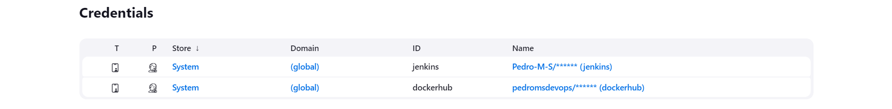

### Jenkins Pipeline

Create a Jenkins pipeline to automate the build, test, and deployment processes for the Gradle-Basic-Demo project.

**Checkout Stage:** In this stage, the pipeline clones the repository from GitHub using the provided credentials. It
ensures the latest
code is pulled from the 'main' branch, allowing the subsequent stages to work with the most recent version of the code.

**Assemble Stage:** During this stage, the script navigates to the specified directory and uses Gradle to
clean and assemble the project. This step ensures that the project's build files are prepared and compiled, setting the
stage for testing and packaging.

**Test Stage:** This stage involves running the project's tests using Gradle and publishing the test results. By using
the `junit` plugin to handle
test reports, it ensures that any test failures are clearly visible within Jenkins, facilitating quick identification
and resolution of issues.

**Archive Stage:** In this stage, the script archives the built artifacts. This involves storing the distributions
generated by the build process, ensuring that the outputs are preserved and can be accessed later for deployment or
further testing.

2. **Implementation:**

```groovy
pipeline {
    agent any

    stages {
        stage('Checkout') {
            steps {
                echo 'Checking out...'
                git branch: 'main', credentialsId: 'jenkins', url: 'https://github.com/Pedro-M-S/devops-23-24-JPE-PSM-1231853.git'
            }
        }
        stage('Assemble') {
            steps {
                dir('CA2/part1/gradle_basic_demo') {
                    echo 'Assembling...'
                    sh 'chmod +x gradlew'
                    sh './gradlew clean assemble'
                }
            }
        }
        stage('Test') {
            steps {
                dir('CA2/part1/gradle_basic_demo') {
                    echo 'Testing...'
                    sh './gradlew test'
                    junit 'build/test-results/test/*.xml'
                }
            }
        }
        stage('Archive') {
            steps {
                dir('CA2/part1/gradle_basic_demo') {
                    echo 'Archiving...'
                    archiveArtifacts 'build/distributions/*'
                }
            }
        }
    }
}
```

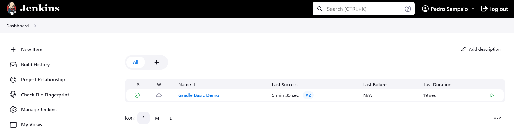
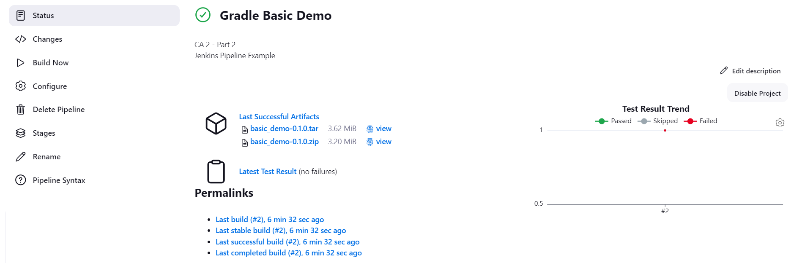
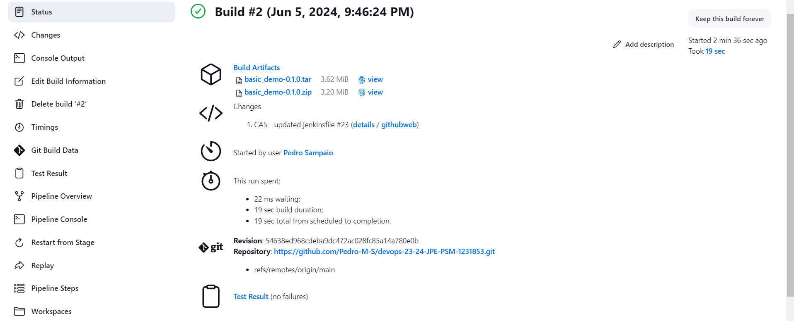
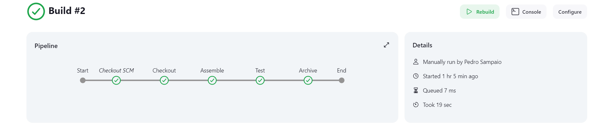
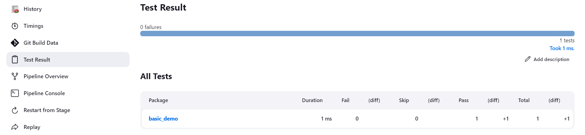

### Gradle React and Spring Data Rest Basic - Pipeline

### Analysis and Implementation

### Analysis

### Jenkins and Docker Configuration

In order to complete this part of the assigment we need to run a Jenkins environment that has Docker installed. We have
two options to achieve this:

- Docker-in-Docker
- Create a custom Jenkins Docker image and bind-mount the container to the host system daemon

In this case, we will use the second option. We will create a custom Jenkins Docker image that includes the necessary
dependencies to run Docker commands. This image will be based on the official Jenkins image and will install Docker
inside the container.

Create a Dockerfile that extends the official Jenkins image and installs Docker inside the container. The Dockerfile
should include the following steps:

```dockerfile
FROM jenkins/jenkins:lts
USER root
RUN apt-get update -qq \
    && apt-get install -qqy apt-transport-https ca-certificates curl gnupg2 software-properties-common
RUN curl -fsSL https://download.docker.com/linux/debian/gpg | apt-key add -
RUN add-apt-repository \
   "deb [arch=amd64] https://download.docker.com/linux/debian \
   $(lsb_release -cs) \
   stable"
RUN apt-get update  -qq \
    && apt-get -y install docker-ce
RUN usermod -aG docker jenkins
```

After creating the Dockerfile, build the custom Jenkins image using the following command in same directory as the
Dockerfile:

```bash
docker image build -t custom-jenkins-docker .
```

To store Jenkins, you need to create an explicit volume for Jenkins on your host machine.
To do that, add this argument ``-v jenkins_home:/var/jenkins_home`` when running the custom Jenkins image.

Also, to connect the Docker CLI in the Jenkins container to the Docker daemon on the host machine by bind mounting the
daemon’s socket into the container add this argument  ``-v /var/run/docker.sock:/var/run/docker.sock``.

Note: On windows this argument should be ``-v //var/run/docker.sock:/var/run/docker.sock``.

```bash
docker run -it -p 8080:8080 -p 50000:50000 -v /var/run/docker.sock:/var/run/docker.sock -v jenkins_home:/var/jenkins_home custom-jenkins-docker
```


#### Jenkins Pipeline

Create a Jenkins pipeline to automate the build, test, and deployment processes for the
Gradle-React-Spring-Data-Rest-Basic project.

**Checkout Stage:** In this stage, the pipeline clones the repository from GitHub using the provided
credentials. This ensures the latest code is pulled from the 'main' branch.

**Assemble Stage:** During this stage, the script navigates to the specified directory and uses Gradle to
clean and assemble the project. This prepares the project for testing and packaging.

**Test Stage:** This stage involves running the project's tests using Gradle and publishing the test results.
It uses the `junit` plugin to handle test reports, ensuring any test failures are visible in Jenkins.

**Javadoc Stage:** In this stage, the script generates Javadoc documentation for the project using Gradle.
The generated documentation is then published as an HTML report in Jenkins, making it easily accessible for review.
It's necessary to install the `HTML Publisher` plugin in Jenkins to publish the Javadoc.

**Docker Image Build Stage:** This stage builds a Docker image for the application using the
provided Dockerfile. The image is tagged with the build number for versioning purposes.

**Docker Login and Push Stages:** This stage logs into Docker Hub using credentials stored in Jenkins then pushes
the newly built Docker image to Docker Hub, making it available for deployment.

**Archiving Stage:** In this stage, the script archives the built artifacts (typically JAR or WAR files)
for future reference or deployment. This ensures that the build outputs are preserved.

**Post-build Cleanup:** Finally, in the post section, the pipeline always performs cleanup actions. It removes the
Docker image from the local environment to save space and logs out from Docker Hub to ensure security.

#### Dockerfile

The accompanying Dockerfile specifies a Tomcat base image with JDK 17 and copies the built WAR file into the Tomcat
webapps directory. It exposes port 8080, which is the default port for Tomcat, allowing the application to be accessible
once deployed.

### Implementation

```groovy
pipeline {
    agent any

    environment {
        DOCKERHUB_TOKEN = credentials('dockerhub')
        IMAGE_NAME = "${env.DOCKERHUB_TOKEN_USR}/jenkins-docker-react-basic"
    }

    stages {
        stage('Checkout') {
            steps {
                echo 'Checking out...'
                git branch: 'main', credentialsId: 'jenkins', url: 'https://github.com/Pedro-M-S/devops-23-24-JPE-PSM-1231853.git'
            }
        }

        stage('Assemble') {
            steps {
                dir('CA2/part2/react-and-spring-data-rest-basic') {
                    echo 'Assembling...'
                    sh 'chmod +x gradlew'
                    sh './gradlew clean assemble'
                }
            }
        }

        stage('Test') {
            steps {
                dir('CA2/part2/react-and-spring-data-rest-basic') {
                    echo 'Testing...'
                    sh './gradlew test'
                    junit 'build/test-results/test/*.xml'
                }
            }
        }

        stage('Javadoc') {
            steps {
                dir('CA2/part2/react-and-spring-data-rest-basic') {
                    echo 'Generating Javadocs...'
                    sh './gradlew javadoc'
                    publishHTML(target: [
                            reportDir  : 'build/docs/javadoc',
                            reportFiles: 'index.html',
                            reportName : 'Javadoc'])
                }
            }
        }

        stage('Build Docker Image') {
            steps {
                dir('CA2/part2/react-and-spring-data-rest-basic') {
                    echo 'Building Docker Image...'
                    script {
                        dockerImage = docker.build("${IMAGE_NAME}:${BUILD_NUMBER}", "-f Dockerfile .")
                    }
                }
            }
        }

        stage('Docker Login') {
            steps {
                echo 'Logging in to Docker Hub...'
                sh 'echo $DOCKERHUB_TOKEN_PSW | docker login -u $DOCKERHUB_TOKEN_USR --password-stdin'
            }
        }

        stage('Push Docker Image') {
            steps {
                echo 'Pushing Docker Image...'
                sh 'docker push $IMAGE_NAME:$BUILD_NUMBER'
            }
        }

        stage('Archiving') {
            steps {
                dir('CA2/part2/react-and-spring-data-rest-basic') {
                    echo 'Archiving...'
                    archiveArtifacts 'build/libs/*'
                }
            }
        }
    }

    post {
        always {
            echo 'Cleaning up...'
            sh 'docker rmi $IMAGE_NAME:$BUILD_NUMBER'
            sh 'docker logout'
        }
    }
}
```

```dockerfile
FROM tomcat:10-jdk17

COPY build/libs/react-and-spring-data-rest-basic-0.0.1-SNAPSHOT.war /usr/local/tomcat/webapps/

EXPOSE 8080
```

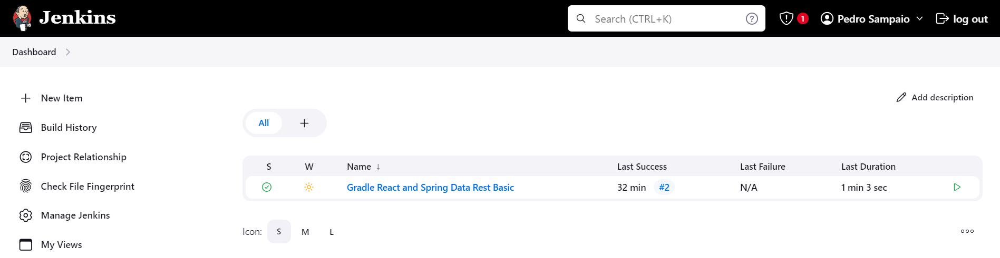
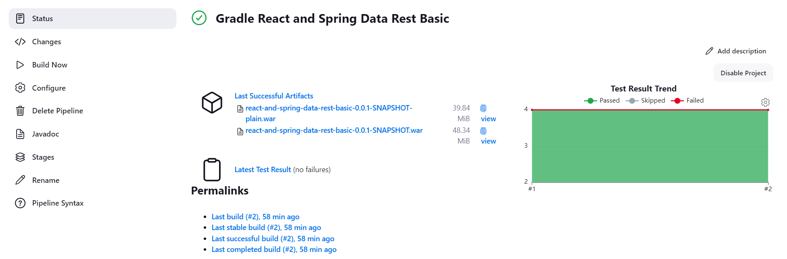
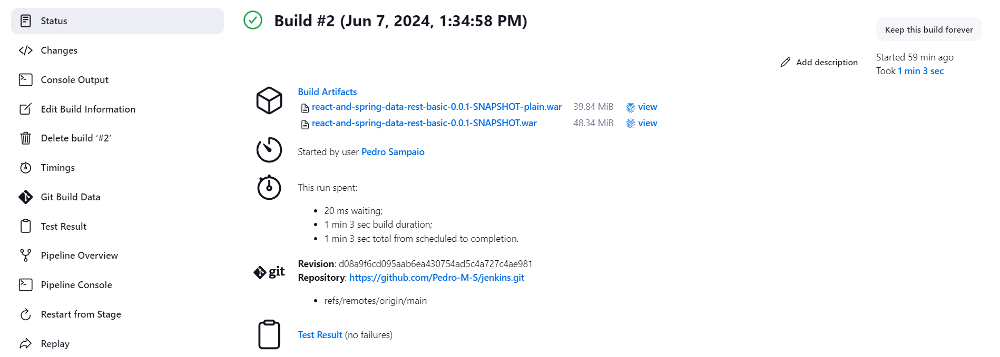
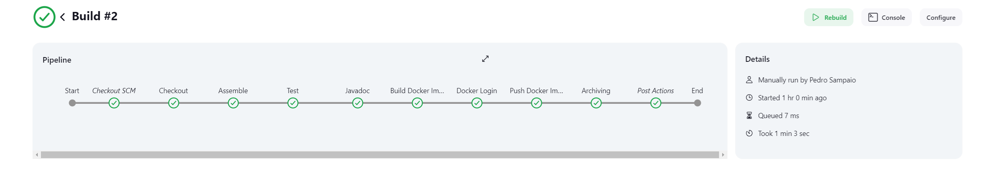
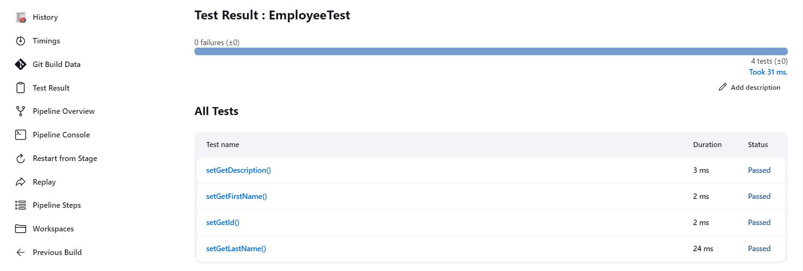
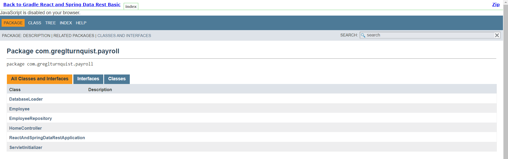
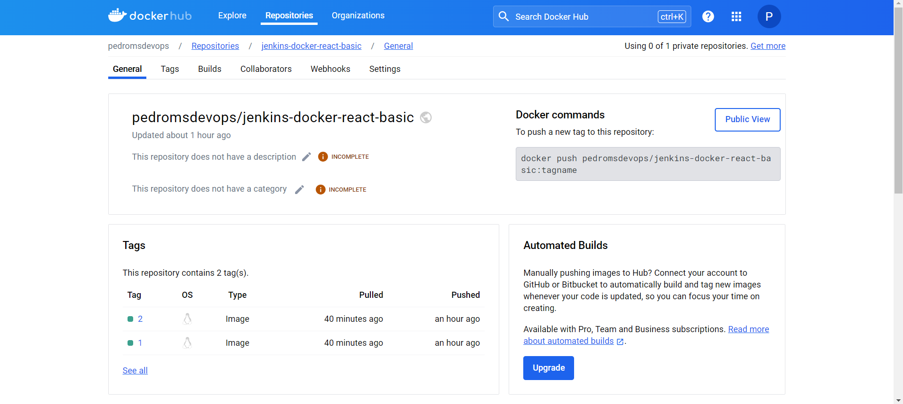
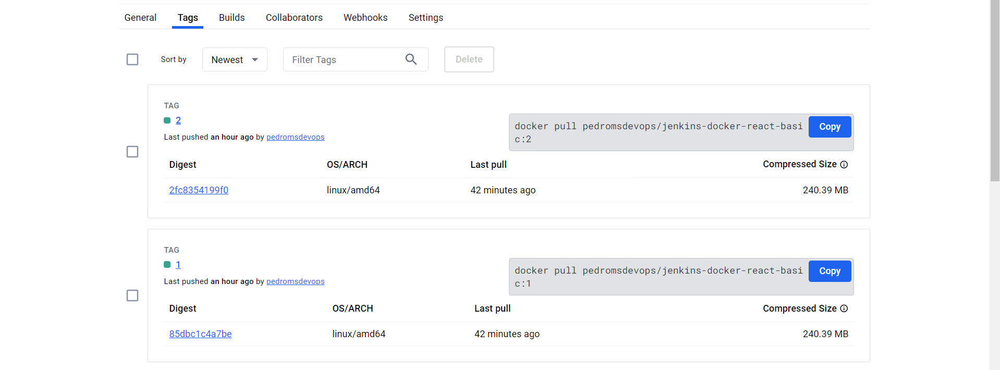


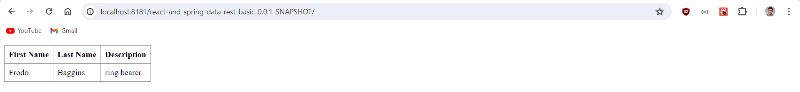

### Conclusion

In conclusion, Jenkins is a powerful automation server that enables teams to implement Continuous Integration and Continuous
Delivery pipelines for their software projects. By defining build processes as code using Jenkinsfiles, teams can version
control and automate the entire software development lifecycle, from building and testing to deployment and monitoring. In
this CA5, we demonstrated how to create Jenkins pipelines for two Gradle projects, Gradle-Basic-Demo and Gradle-React-Spring-Data-Rest-Basic,
and automate the build, test, and deployment processes for these projects. We also explored how to configure Jenkins to run
in a Docker container and build Docker images as part of the pipeline. By leveraging Jenkins and Docker, teams can streamline
their development workflows, improve collaboration, and deliver high-quality software products more efficiently.